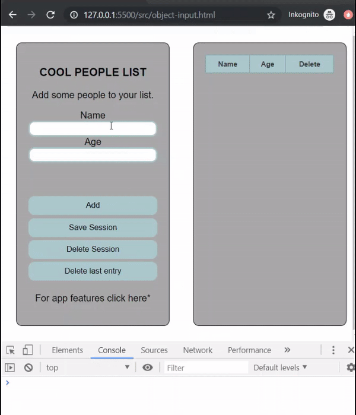

# CoolPeopleList, safe input as object, build Table ![badge]

App will safes value of input field as object in array. Based on content of array
a HTML table is build.

[badge]: https://img.shields.io/badge/status-stable-green.svg

### Project completed

All features implemented and working.

### Features

1. Object constructor, safes input's value in object as value:key pair
2. LocalStorage: Safes array in LS, load LS if data is safed on page load
3. Builds HTML table: ('<tr><td>' + coolPeople[i].Name + '</td><td>' + coolPeople[i].Age)
4. Delete button in HTML table, deletes from array and reload the table build function
5. Error handling (console)
6. Hotkeys: TAB - first input field, next field, enter = add button

### What I learned

- Object constructor
- Build HTML table
- Working with local storage
